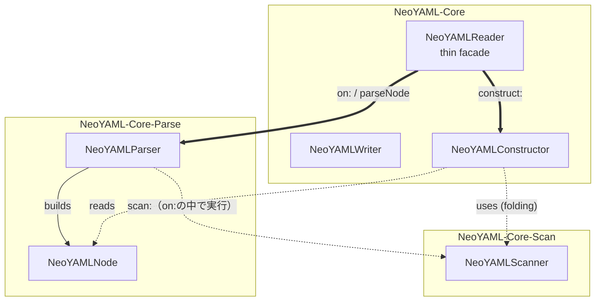
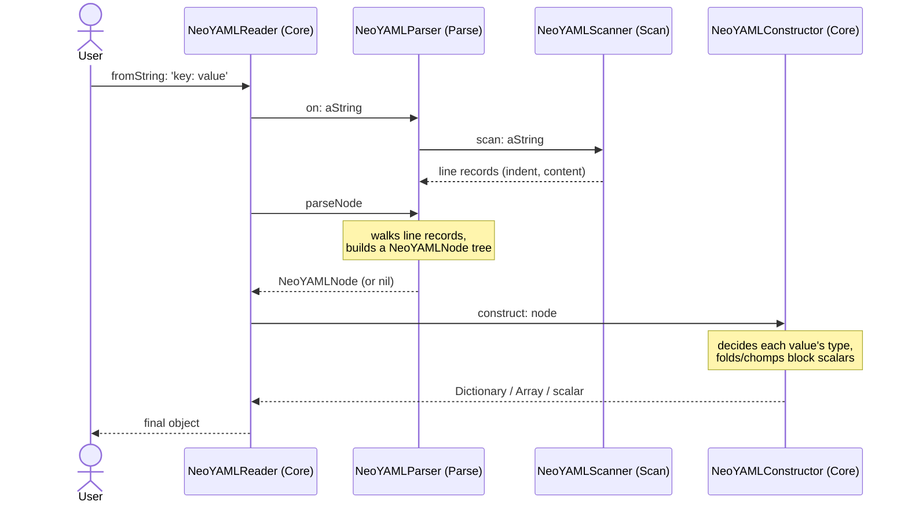

# アーキテクチャ

> English version: [architecture.md](architecture.md)

NeoYAMLは[NeoJSON](https://github.com/svenvc/NeoJSON)のオブジェクト形状とYAML
テキストを2つの方向で変換します。2つの方向は作りが異なります。

- **読み込み**(YAML→オブジェクト)、`NeoYAMLReader` — 処理をscan・parse・
  constructの3つのステージに分け、各ステージを独立したパッケージにしています。
- **書き込み**(オブジェクト→YAML)、`NeoYAMLWriter` — シリアライザ(直列化器)
  です。オブジェクトをたどってテキストを出力する、単一パスの処理です。

## 読み込みパイプライン

読み込みは、処理をscan・parse・constructの3つのステージに分けています。この
3段構成は、コンパイラが行う字句解析・構文解析・意味解析の分け方と同じ流れで、
本格的なYAMLパーサー(libyaml、PyYAMLなど)も同様の段階に分かれています。

| ステージ | クラス | コンパイラで言うと | やること |
|---|---|---|---|
| scan | `NeoYAMLScanner` | 字句解析(行レベル) | ソーステキストを行レコード(`indent`と`content`)に分ける |
| parse | `NeoYAMLParser` | 構文解析 | 行レコードから`NeoYAMLNode`の構文木を組み立てる |
| construct | `NeoYAMLConstructor` | 意味解析・評価 | 構文木から最終的な型付きオブジェクトを作る |

スキャナはテキストを行(インデントと内容)に分けるだけで、コロンやダッシュ、
引用符といった細かいトークンの認識はparseステージが行います。パーサーは木の
構造を組み立てますが、値の最終的な型は決めません。スカラー(scalar、単一の値)が
引用符付きだったかと、明示的タグが付いていたかを記録し、型の判断はconstructに
任せます。

なぜ1回で済まさず、こう分けるのか。早い段階で下した判断(例えば「この空行は
ブロックスカラー(block scalar、複数行の文字列)の中か?」)を、遅い段階
(constructがスカラーの型を決めるとき)
まで残す必要があるためです。ステージを分けておけば、巨大な1メソッドでは
保証できない「その情報を誤って失わない」ことが、構造として保証されます。

## パッケージ構成

- **`NeoYAML-Core-Scan`** — `NeoYAMLScanner`(scanステージ)。
- **`NeoYAML-Core-Parse`** — `NeoYAMLParser`と`NeoYAMLNode`(parseステージ。
  `NeoYAMLNode`はパーサーが組み立てる構文木のノード)。
- **`NeoYAML-Core`** — `NeoYAMLReader`(parseとconstructを順に実行する薄い
  facade)、`NeoYAMLConstructor`(constructステージ)、`NeoYAMLWriter`
  (書き込み方向)。
- **`BaselineOfNeoYAML`** — Metacelloのロード定義。
- **`NeoYAML-Tests`** — SUnitテスト。

scanとparseがそれぞれ独立したパッケージなのは、行スキャナと木のビルダーが、
それ自体で再利用できるからです。constructはパーサーが作る`NeoYAMLNode`の形状に
対する小さな仕上げ処理で、それ自体の再利用価値がないため、4つ目のパッケージには
せず、`NeoYAML-Core`内でリーダーの隣に置いています。依存関係は一方向です。
ParseはScanに依存し、CoreはScanとParseの両方に依存します。

## クラス間の関係

どのクラスがどのパッケージにあり、互いにどう呼び合うかを示します。矢印の意味は
**実線=生成する**、**点線=内部で使う**、**太線=パッケージをまたぐ呼び出し**です。

この図は時間順ではなく、**誰が誰を呼ぶか**という構造の関係を示しています。Reader
が直接呼ぶのはParserとConstructorだけ(太線)で、Scannerは呼びません。scanは
Parserの中で走ります。`NeoYAMLParser on: aString`が、`parseNode`で木を組み立てる
前に、Scannerを使って行レコードを作るからです。だからScannerは「使う」関係を表す
点線で描かれています。scan→parse→constructという時間順そのものは、下の
「読み込みの処理フロー」のシーケンス図が示しています。

`NeoYAMLNode`はアクセサ以外の振る舞いを持ちません。パーサーが組み立て、
コンストラクタが読む構文木のノードそのものです。だからその形状を定義する
パッケージ`NeoYAML-Core-Parse`に置かれ、それを読むだけの`NeoYAML-Core`には
置かれていません。

## 読み込みの処理フロー

`NeoYAMLReader fromString: 'key: value'`の流れを、ソーステキストから最終的な
`Dictionary`まで示します。

`allFromString:`は、ソーステキストを`---`／`...`マーカーで分割したあと、
ドキュメントごとにこの同じ流れを1回ずつ実行します(分割はドキュメントごとの
scan／parse／constructより前に、生テキストの前処理として行われます)。parse
ステージの詳細は[parser.ja.md](parser.ja.md)を参照してください。

## 書き込み処理

`NeoYAMLWriter`はパイプラインではありません。書き込みには、読み込みのような
判断の先送りが要らないので、単一パスです。`write:`は各オブジェクトの実行時型
(`nil`・`Boolean`・`Integer`／`Float`・`String`・`Dictionary`・`Association`・
`SequenceableCollection`)を見て、対応するブロックスタイルのYAMLを出力し、
ネストした値へ再帰します。`writeJSON:`はまず`NeoJSONReader`でJSONテキストを
解析し、そのオブジェクトを`write:`に渡すので、JSONからYAMLへ一気に変換します。
`writeAll:`はコレクションを`---`区切りの複数ドキュメントストリームとして
書き出します。

## 設計方針

- **外部YAMLライブラリを使わない** — 両方向ともスクラッチで実装しています。
  NeoYAMLはNeoJSONだけに依存し、サードパーティのYAML実装を持ち込まず、NeoJSON
  自体と同じ最小限の依存関係に保っています。
- **NeoJSONと同じオブジェクト形状** — リーダーとライターは、`NeoJSONReader`／
  `NeoJSONWriter`が使うのと同じ`Dictionary`／`Array`／`OrderedCollection`／
  `Association`／スカラーの形状を生成・消費します。だからJSONステップをYAML
  ステップに、他を変えずに差し替えられます。
- **段階的な読み込みパイプライン** — 上で述べたとおり、3つのステージが、早い
  段階の判断を、それを必要とする遅い段階まで残します。
- **再利用できる単位にだけパッケージを分ける** — scanとparseは再利用できるので
  独立したパッケージにし、constructはそうでないので`NeoYAML-Core`に置きます。

## 対応範囲

対応済みのYAML 1.2の範囲、意図的に残したギャップ、対応範囲外の機能(アンカー／
エイリアス、カスタムタグ)については[`ROADMAP.md`](../ROADMAP.md)を参照して
ください。
