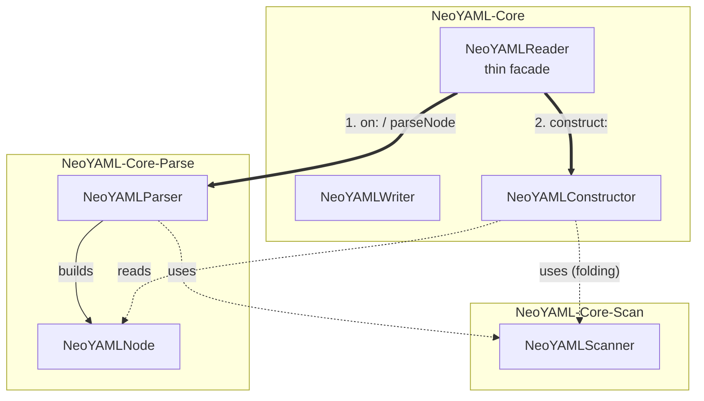
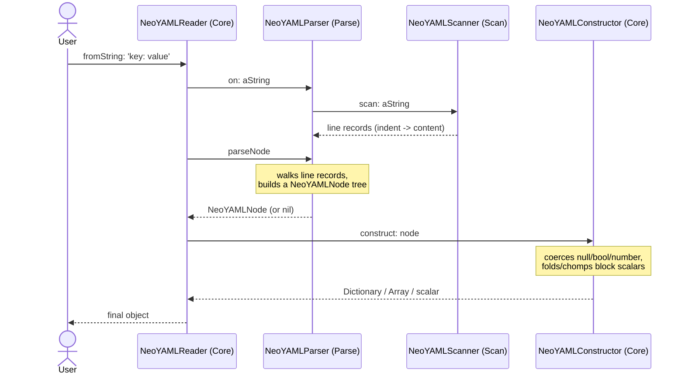

# Architecture

A Pharo adapter between [NeoJSON](https://github.com/svenvc/NeoJSON)'s object
shapes and YAML text. It is split into a write direction (a single-pass
recursive dispatcher) and a read direction (a staged scan / parse+compose /
construct pipeline, each stage in its own package).

## Design philosophy

Four principles guide the design:

- **No external YAML library** — both directions are implemented from
  scratch. NeoYAML depends only on NeoJSON, keeping the same minimal
  dependency footprint that NeoJSON itself has, rather than pulling in a
  third-party YAML implementation.
- **The same object shapes as NeoJSON, both ways** — `NeoYAMLWriter` and
  `NeoYAMLReader` produce and consume exactly the `Dictionary` /
  `Array`/`OrderedCollection` / `Association` / scalar shapes
  `NeoJSONWriter`/`NeoJSONReader` already work with, so nothing downstream
  needs to change to swap a JSON step for a YAML one.
- **The read direction is a staged pipeline, not a single pass** — parsing
  YAML requires a decision made early (e.g. "is this blank line inside a
  block scalar's body?") to still be available late (when construct decides
  a scalar's final type). Splitting scan / parse+compose / construct into
  separate classes makes that impossible to lose by accident, the way a
  single big method could.
- **A package boundary marks a reusable, self-contained unit, not every
  pipeline stage by default** — `NeoYAMLScanner` and `NeoYAMLParser`/`NeoYAMLNode`
  get their own packages because a line scanner and a node-tree builder are
  meaningful on their own. `NeoYAMLConstructor` is a small finishing step
  over the exact `NeoYAMLNode` shape parse+compose produces, with no
  reuse value of its own, so it lives alongside `NeoYAMLReader` and
  `NeoYAMLWriter` in `NeoYAML-Core` instead of in a fourth package.
  Dependencies still point one way — `NeoYAML-Core-Parse` depends on
  `NeoYAML-Core-Scan`; `NeoYAML-Core` (facade + construct) depends on both
  — so nothing depends upward.

## Packages

- **`NeoYAML-Core`** — `NeoYAMLWriter` (the write direction, self-contained);
  `NeoYAMLReader`, a thin facade over the two packages below; `NeoYAMLConstructor`,
  the "construct" stage: node tree → final Dictionary/Array/scalar shapes
- **`NeoYAML-Core-Scan`** — `NeoYAMLScanner`, the "scan" stage: source text
  → blank-line-preserving physical line records
- **`NeoYAML-Core-Parse`** — `NeoYAMLParser`/`NeoYAMLNode`, the "parse +
  compose" stage: line records → an untyped node tree
- **`BaselineOfNeoYAML`** — Metacello load definition (dependencies and
  load order)
- **`NeoYAML-Tests`** — SUnit tests

## Class relationships

Which class lives in which package, and how they call each other. Arrows
mean: **solid = creates**, **dotted = used internally**, **bold = cross-
package call**.

`NeoYAMLNode` carries no behavior of its own beyond accessors — it is the
data structure `NeoYAMLParser` produces and `NeoYAMLConstructor` consumes,
which is why it lives in `NeoYAML-Core-Parse` (the package that defines its
shape) rather than in `NeoYAML-Core` (the package that only reads it).

## Key classes

Listed roughly in the order data flows through them on a read; each class
has a class comment in the System Browser with the details.

1. **`NeoYAMLReader`** — the entry point for reading: `fromString:` hands
   source text to `NeoYAMLParser` and the resulting node to
   `NeoYAMLConstructor`; `allFromString:` splits a `---`/`...` multi-document
   stream first and reads each document the same way.
2. **`NeoYAMLScanner`** — turns source text into `indent -> content`
   line records, preserving blank lines as a `-1 -> ''` sentinel so later
   stages can decide for themselves whether a blank line is insignificant
   or (inside a block scalar) must be kept.
3. **`NeoYAMLParser`** — walks the line records: indentation recognizes
   block mappings/sequences, a character-stream sub-parser handles flow
   mappings/sequences, and it builds a `NeoYAMLNode` tree capturing
   structure, scalar quoting style, and any explicit tag — without yet
   deciding a scalar's final Smalltalk type.
4. **`NeoYAMLNode`** — the untyped tree node `NeoYAMLParser` builds and
   `NeoYAMLConstructor` reads; one class with a `kind` (`#mapping`/
   `#sequence`/`#scalar`) rather than a subclass per kind.
5. **`NeoYAMLConstructor`** — walks the node tree and produces the final
   native objects: null/boolean/number coercion for a plain scalar, an
   explicit tag overriding that, and folding/chomping for a block scalar.
   Lives in `NeoYAML-Core` alongside `NeoYAMLReader` (see "Design
   philosophy" above for why it doesn't get its own package).
6. **`NeoYAMLWriter`** — the write direction: `write:` recursively
   dispatches on the runtime type of the object it is given and streams
   block-style YAML; `writeJSON:` parses JSON text via `NeoJSONReader
   fromString:` first, so it works end-to-end from raw JSON; `writeAll:`
   writes a collection as a `---`-separated multi-document stream.

## Read flow

The flow of `NeoYAMLReader fromString: 'key: value'`, from source text to
the final `Dictionary`.

`allFromString:` runs this same flow once per document after splitting the
source text on `---`/`...` markers (a raw-text preprocessing step, before
any per-document scan/parse/construct).

## Write flow

`NeoYAMLWriter` has no staged pipeline — serialization does not need the
delayed decision-making that YAML parsing does. `write:` recursively
dispatches on the runtime type of the object it is given (`nil`, `Boolean`,
`Integer`/`Float`, `String`, `Dictionary`, `Association`,
`SequenceableCollection`) and streams YAML text directly, one class, one
pass. `writeJSON:` is the JSON→YAML adapter: it parses JSON text via
`NeoJSONReader fromString:` first, then hands the resulting object to
`write:`.

## Scope

See [`ROADMAP.md`](../ROADMAP.md) for what YAML 1.2 coverage is done,
which gaps are intentionally left in, and which features (anchors/aliases,
custom tags) are explicitly out of scope.
