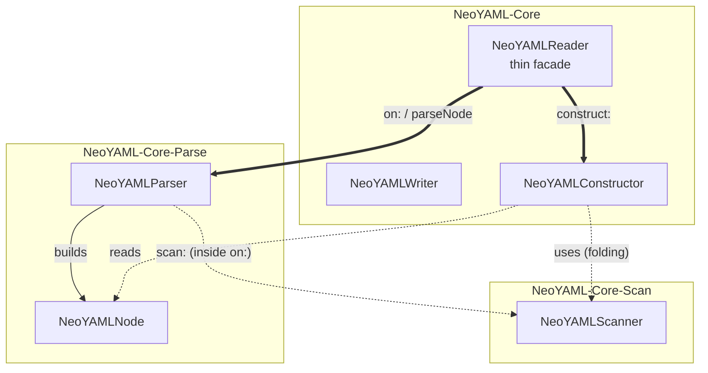
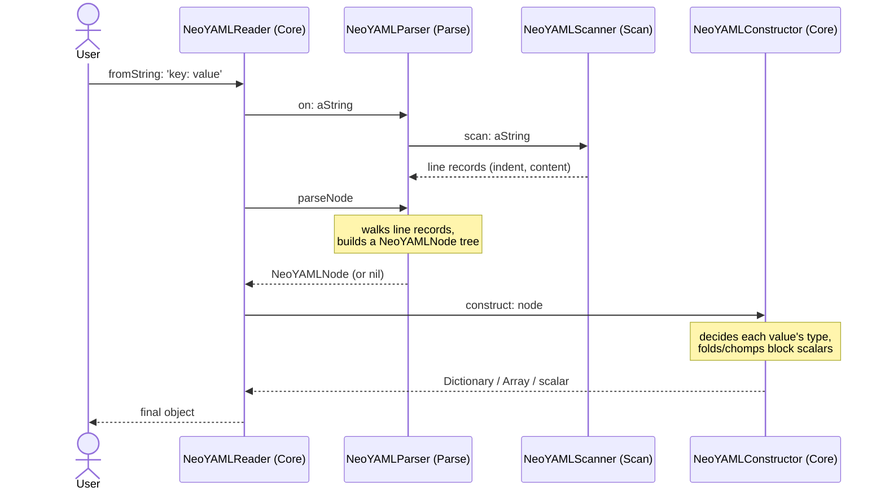

# Architecture

> 日本語版: [architecture.ja.md](architecture.ja.md)

NeoYAML converts between [NeoJSON](https://github.com/svenvc/NeoJSON)'s object
shapes and YAML text in two directions, and the two have different shapes:

- **Read** (YAML → objects), `NeoYAMLReader` — the work is split into three
  stages, scan, parse, and construct, each in its own package.
- **Write** (objects → YAML), `NeoYAMLWriter` — a serializer: a single pass
  that walks the object and emits text.

## Read pipeline

Reading splits the work into scan, parse, and construct. This three-stage
split follows the same flow a compiler uses — lexical analysis, syntactic
analysis, semantic analysis — and real YAML parsers (libyaml, PyYAML) are
divided into similar stages.

| Stage | Class | In compiler terms | What it does |
|-------|-------|----------------------|--------------|
| scan | `NeoYAMLScanner` | lexical analysis (line level) | source text → line records (`indent`, `content`) |
| parse | `NeoYAMLParser` | syntactic analysis | line records → a syntax tree of `NeoYAMLNode`s |
| construct | `NeoYAMLConstructor` | semantic analysis / evaluation | syntax tree → final typed objects |

The scanner only splits text into lines (indentation plus content); the finer
tokens (`:`, `-`, quotes) are recognized in the parse stage. The parser builds
the tree structure but does not decide any value's final type — it records
whether a scalar was quoted and any explicit tag, and leaves the type decision
to construct.

Why split it this way instead of doing everything in one pass? A decision made
early (for example, "is this blank line inside a block scalar?") must still be
available late (when construct decides a scalar's type). Separate stages make
that information impossible to lose by accident, which a single large method
could not guarantee.

## Packages

- **`NeoYAML-Core-Scan`** — `NeoYAMLScanner` (the scan stage).
- **`NeoYAML-Core-Parse`** — `NeoYAMLParser` and `NeoYAMLNode` (the parse
  stage; `NeoYAMLNode` is the syntax-tree node the parser builds).
- **`NeoYAML-Core`** — `NeoYAMLReader` (a thin facade that runs parse then
  construct), `NeoYAMLConstructor` (the construct stage), and `NeoYAMLWriter`
  (the write direction).
- **`BaselineOfNeoYAML`** — the Metacello load definition.
- **`NeoYAML-Tests`** — SUnit tests.

Scan and parse each get their own package because a line scanner and a tree
builder are reusable on their own. Construct is a small finishing step over the
exact `NeoYAMLNode` shape the parser produces, with no reuse value of its own,
so it stays in `NeoYAML-Core` next to the reader instead of getting a fourth
package. Dependencies point one way: Parse depends on Scan, and Core depends on
both.

## Class relationships

Which class lives in which package, and how they call each other. Arrows mean:
**solid = creates**, **dotted = used internally**, **bold = cross-package
call**.

This diagram shows structural relationships — who calls whom — not the
timeline. The Reader calls the Parser and the Constructor directly (solid
arrows), but not the Scanner. Scanning runs inside the Parser:
`NeoYAMLParser on: aString` builds the line records through the Scanner before
`parseNode` walks them, which is why the Scanner is drawn as a dotted
"used-by" arrow. The scan → parse → construct order over time is shown by the
"Read flow" sequence diagram below.

`NeoYAMLNode` has no behavior beyond accessors — it is just the syntax-tree
node the parser builds and the constructor reads, which is why it lives in
`NeoYAML-Core-Parse` (the package that defines its shape) rather than in
`NeoYAML-Core` (the package that only reads it).

## Read flow

The flow of `NeoYAMLReader fromString: 'key: value'`, from source text to the
final `Dictionary`.

`allFromString:` runs this same flow once per document after splitting the
source text on `---`/`...` markers (a raw-text preprocessing step, before any
per-document scan/parse/construct). For the parse stage in depth, see
[parser.md](parser.md).

## Write pass

`NeoYAMLWriter` is not a pipeline. Writing does not need the delayed decisions
reading does, so it is a single pass: `write:` looks at each object's runtime
type (`nil`, `Boolean`, `Integer`/`Float`, `String`, `Dictionary`,
`Association`, `SequenceableCollection`), emits the matching block-style YAML,
and recurses into nested values. `writeJSON:` first parses JSON text with
`NeoJSONReader`, then hands the object to `write:`, so it converts JSON to YAML
end to end. `writeAll:` writes a collection as a `---`-separated multi-document
stream.

## Design decisions

- **No external YAML library** — both directions are implemented from scratch.
  NeoYAML depends only on NeoJSON, keeping the same minimal dependencies
  NeoJSON itself has, rather than pulling in a third-party YAML implementation.
- **The same object shapes as NeoJSON** — the reader and writer produce and
  consume exactly the `Dictionary` / `Array` / `OrderedCollection` /
  `Association` / scalar shapes `NeoJSONReader`/`NeoJSONWriter` use, so a YAML
  step can replace a JSON step with no other changes.
- **A staged read pipeline** — the three stages keep an early decision
  available to the later stage that needs it, as described above.
- **Packages only for reusable units** — scan and parse are reusable and get
  their own packages; construct is not, so it stays in `NeoYAML-Core`.

## Scope

See [`ROADMAP.md`](../ROADMAP.md) for the YAML 1.2 coverage that is done, the
gaps left in on purpose, and the features (anchors/aliases, custom tags) that
are out of scope.
