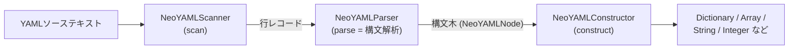
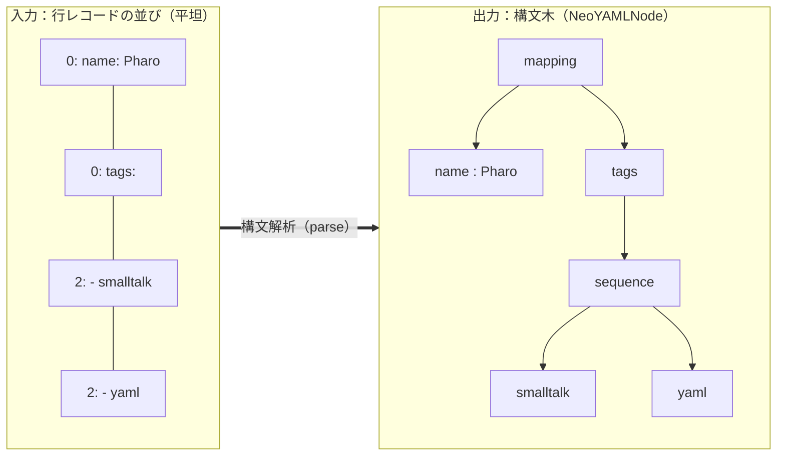

# パーサー内部

> English version: [parser.md](parser.md)

`NeoYAMLParser`(パッケージ`NeoYAML-Core-Parse`)は、読み込みパイプラインの
**parse**ステージ、つまり**構文解析**を担当するクラスです。スキャナが作った
平坦な行の並びを受け取り、YAMLの構造を表す木(構文木)に組み立てます。上位の
パッケージ構成や読み書きの全体像は[architecture.ja.md](architecture.ja.md)を
参照してください。ここではパーサー内部の動きに絞って説明します。

## この文書で使うYAMLの用語

以下はYAML 1.2.2仕様で定義された正式な用語です。訳さず、仕様どおりの英語
(カタカナ表記)で使います。

| 用語 | 英語(YAML仕様) | 意味 |
|---|---|---|
| スカラー | scalar | 単一の値(文字列・数値・真偽値・null) |
| マッピング | mapping | キーと値の対応(`key: value`)。Pharoの`Dictionary`になる |
| シーケンス | sequence | 値の並び(`- item`)。`Array`になる |
| ブロックスタイル | block style | インデントで構造を表す、複数行の書き方 |
| フロースタイル | flow style | `{a: 1, b: 2}`や`[1, 2, 3]`のようにJSON風に1行で書く書き方 |
| ブロックスカラー | block scalar | 複数行の文字列を書く記法(本文で詳述) |
| タグ | tag | `!!str`のように値の型を明示する記法 |

## 読み込みパイプラインにおけるパーサー

読み込みは3つのステージに分かれています。パーサーはその真ん中で、スキャナの
出力を受け取り、構文木をコンストラクタに渡します。



## 構文解析

パーサーがやることは、一般的なコンパイラの構文解析とほぼ同じです。平坦に
並んだ入力(ここでは1行ずつの行レコード)を読み、文法構造を認識して、木を
組み立てます。次の入力を例にとります。

```yaml
name: Pharo
tags:
  - smalltalk
  - yaml
```

この4行が、次のように1つの構文木になります。



重要なのは、この段階では**構造だけを決めて、値の最終的な型は決めない**ことです。
`123`を整数にするか文字列`'123'`にするかは、まだ決めません。パーサーはスカラーが
引用符付きだったか(プレーン／単一引用符／二重引用符)と、明示的タグが付いて
いたかを記録するだけです。実際に型を決めるのは、次の`NeoYAMLConstructor`です。
2つの段階を分けているので、引用符付きの`'123'`は文字列のまま残り、素の`123`は
数値になります。

## 入力（行レコード）

スキャナはパーサーに、1行につき1つの`indent -> content`のペアを、順番どおりに
並べたリストで渡します。空行はセンチネル`-1 -> ''`として残されます。パーサーは
このリストを`entries`に持ち、1始まりの`position`で先頭から読み進めます。

先ほどのYAMLは、次の行レコードになります。

| position | indent | content        |
|----------|--------|----------------|
| 1        | `0`    | `name: Pharo`  |
| 2        | `0`    | `tags:`        |
| 3        | `2`    | `- smalltalk`  |
| 4        | `2`    | `- yaml`       |

生テキストを読み直すことはありません。インデントは計算済みで、空行やコメントの
扱いは読み進めながら行ごとに判断します。位置の管理は2つのメソッドが担います。
`skipBlankEntries`は空行やコメントだけの行を読み飛ばし、`advance`は1行を消費した
あとに1つ進めます。

## ノード種別の判定（parseNodeAtIndent:）

処理は`parseNode`から始まり、終端でなければ現在行のインデントを渡して
`parseNodeAtIndent:`を呼びます。これは再帰下降パーサの予測的な判定で、行の
先頭を見て、どの生成規則(ノードの種類)を適用するかを選びます。

パーサーが認識するノードを、EBNFで表すと次のようになります(YAML全体では
なく、パーサーが扱う部分文法です。正確な対応範囲は[ROADMAP.md](../ROADMAP.md)を
参照)。`parseNodeAtIndent:`は`node`の選択肢を上から順に試し、行の先頭が最初に
一致した規則を使います。

```ebnf
node        = flow-collection    (* 行が { または [ で始まる  *)
            | tagged-node        (* 行が !! で始まる          *)
            | block-scalar       (* 行が | または > のヘッダ  *)
            | sequence           (* 行が "-" 単独か "- "      *)
            | mapping            (* 行に "key:" がある        *)
            | scalar ;           (* いずれにも当たらない      *)

sequence    = seq-item { seq-item } ;   (* すべて同じインデント *)
seq-item    = "-" [ " " node ] ;        (* 値が無ければ空スカラー *)

mapping     = map-entry { map-entry } ; (* すべて同じインデント *)
map-entry   = scalar ":" node ;         (* node は同じ行、または次行以降の深いインデント *)

flow-collection = flow-mapping | flow-sequence ;
flow-mapping    = "{" [ flow-pair { "," flow-pair } ] "}" ;
flow-sequence   = "[" [ flow-value { "," flow-value } ] "]" ;
flow-pair       = flow-value ":" flow-value ;
flow-value      = flow-mapping | flow-sequence | scalar ;

tagged-node = "!!" tag-name [ scalar | flow-collection ] ;

block-scalar = ( "|" | ">" ) [ "-" | "+" ] newline indented-lines ;

scalar      = plain | single-quoted | double-quoted ;
```

文法中の `tag-name`・`plain`・`single-quoted`・`double-quoted`・`indented-lines`・
`newline` は**終端記号(字句)**です。それ以上分解しない、いちばん細かい単位なので、
文法規則としては定義せず、そのまま扱います。それぞれの意味は次のとおりです。

| 終端記号 | 意味 |
|---|---|
| `plain` | 引用符なしのスカラー(例:`hello`、`123`) |
| `single-quoted` | 単一引用符の文字列(`'...'`) |
| `double-quoted` | 二重引用符の文字列(`"..."`) |
| `tag-name` | `!!` の後ろの名前(`!!str` の `str`) |
| `indented-lines` | ブロックスカラーの本文行(字下げされた複数行) |
| `newline` | 改行 |

`node`選択肢の右側のコメントが、その規則を選ぶ先頭トークン(先読み)です。上から
順に試すため、`-5`のようにスカラーとシーケンスの両方に見えうる入力も、正しい
規則に振り分けられます。この予測を支える2つの認識メソッドは、スカラーの中身を誤って
シーケンスやマッピングと判断しないよう、あえて条件を狭くしています。

- `looksLikeSequenceItem:` — 行が`-`一文字だけ、または`- `(ダッシュと
  スペース)で始まる場合だけ、シーケンス項目とみなします。`-5`はシーケンス
  項目ではなく、スカラーです。
- `looksLikeMappingEntry:` — 引用符の外にあるコロンの直後に、スペースか行末が
  続く場合だけ、マッピング項目とみなします。引用符の中かどうかは
  `topLevelColonIndexIn:`が追跡します。そのため`url: http://x`は最初の`: `だけで
  分割され、`"a: b": value`は引用符の中のコロンでは分割されません。

## ブロックスタイルとフロースタイルの解析

前節のEBNFにあるコレクション(マッピング／シーケンス)には、2つの書き方が
あります。**ブロックスタイル**は複数行に展開し、**フロースタイル**は`[a, b]`や
`{k: v}`のように1行で書きます。パーサーは、値が`{`か`[`で始まればフロースタイル、
そうでなければブロックスタイルとして解析します。同じ文法でも、読み取りの手法が
次のように異なります。

| 観点 | ブロックスタイル | フロースタイル |
|---|---|---|
| 書き方 | 複数行・インデント | 1行(`[a, b]`、`{k: v}`) |
| 読み取り単位 | 行を1行ずつ、インデントで構造を判断 | 1行を文字単位で走査 |
| 担当メソッド | `parseMappingNodeAtIndent:`、`parseSequenceNodeAtIndent:` | `parseFlowMappingNode:`、`parseFlowSequenceNode:` |

どちらも、値が入れ子になっていれば同じ手順を再帰的に繰り返します。以降で、
それぞれの読み取りを詳しく見ます。

### ブロックスタイル（インデント方式）

`parseMappingNodeAtIndent:`と`parseSequenceNodeAtIndent:`はそれぞれループし、
行が同じ種類の構造に見え続ける限り、**同じインデント**の行を兄弟として集めます。

```smalltalk
[ self atEnd not
    and: [ self currentIndent = indent
        and: [ self looksLikeMappingEntry: self currentText ] ] ]
    whileTrue: [ entries add: (self parseMappingEntryNodeAt: indent) ].
```

各項目では、`parseMappingEntryNodeAt:`がコロンでキーと値を分け、値の側を
`resolveValueNodeText:atParentIndent:`に渡します。ここでネストが起こります。
このメソッドは次の3つを順に見ます。

1. 同じ行に**明示的タグ／ブロックスカラー**があれば、それを作る。
2. **値が空**なら(例：項目が次の行以降にある`tags:`)、1段深いインデントの
   子ブロックへ再帰する。
3. **同じ行に値がある**なら、スカラー(または`{`／`[`で始まればフロー
   コレクション)を作る。

これが、`tags:`の次にインデントされた`- smalltalk`／`- yaml`が続くとき、
`tags`の値がシーケンスノードになる仕組みです。値が空なのでケース2に入り、
1段深いインデントの子ブロックを再帰的に読み取ります。

### フロースタイル（文字ストリーム方式）

値が`{`や`[`で始まると、パーサーは行単位の読み取りをやめ、そのテキスト上の
`ReadStream`に切り替えて、開きかっこ・カンマ区切り・閉じかっこを順に読みます。要素ごとに
`parseFlowValueNode:`を呼び、その中でネストした`{`／`[`にも入れます。空白は
`skipFlowWhitespace:`で読み飛ばし、引用符付きスカラーは`extractFlowQuotedText:`
がそのまま取り出すので、引用符の中のカンマやかっこで要素が途切れることは
ありません。

## ブロックスカラーの解析

ブロックスカラーのヘッダ(`|`・`>`、任意で`-`／`+`のchomping指定子)は
`isBlockScalarHeader:`が判定します。その後
`parseBlockScalarNodeWithHeader:`が、**親より深くインデントされた**後続行を、
空行も含めて集めます。

```smalltalk
blockScalarShouldContinueAt: parentIndent
    | entry |
    entry := entries at: position.
    entry key = -1 ifTrue: [ ^ true ].          "空行：残す"
    ^ entry key > parentIndent                  "親より深い：本文の一部"
```

ここで空行を残すことが、スキャナが空行を捨てずに`-1 -> ''`として残しておく
理由です。ブロックスカラーの中では、空行は本物の内容であり、`#`もコメントでは
なく文字そのものです。集めた行は`joinBlockScalarLines:`で再結合し、各行の
インデントは自動検出した基準インデント(最初の非空行のインデント)からの相対で
復元します。ノードは`style`(`#literal`／`#folded`)と生の`chomping`文字だけを
記録し、実際のfolding／chompingはコンストラクタに任せます。

## 引用符を考慮したコメント除去

コメントは、先に一括で消すのではなく、パーサーが読み進めながら行ごとに消します
(`stripCommentFrom:`)。ポイントは、`#`がコメントになるのは、行頭か空白の直後に
あり、**かつ**引用符付き文字列の外にある場合だけ、ということです。
`commentStartIndexIn:`は行を1文字ずつ読み、引用符の内外を追跡します。その結果、
次のようになります。

- `key: value # note` は ` # note` を除去します。
- `key: "a # b"` は `#` を残します(二重引用符の中にあるため)。
- `url: http://x#y` は `#` を残します(直前に空白がないため、コメントではありません)。

同じ引用符の追跡は、キーと値を分けるコロンを探す`topLevelColonIndexIn:`でも
使っています。どちらも、YAMLのプレーンスカラーが`#`や`:`を含みうるために必要な
小さな文字スキャンです。

## パーサーが行わない処理

- **型の決定** — 値を最終的にどの型にするかは、コンストラクタが決めます。
  たとえば同じ`123`でも、引用符がなければ整数、`'123'`のように引用符が付いて
  いれば文字列になります。パーサーは、引用符の種類(`style`)とタグ(`tag`)を
  記録するだけで、型そのものは決めません。
- **ブロックスカラーのfolding／chomping** — パーサーは生の本文とヘッダを
  記録するだけで、fold／chompはコンストラクタが行います。
- **ドキュメントの分割** — `---`／`...`による複数ドキュメントの分割は、
  パーサーが動く前に`NeoYAMLReader`が生テキストの前処理として行います。パーサーは
  常に1ドキュメント分の行だけを見ます。

対応するYAML機能の正確な範囲と既知の制限については、`NeoYAMLReader`のクラス
コメントと[ROADMAP.md](../ROADMAP.md)を参照してください。
