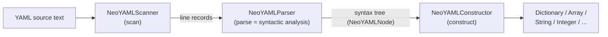
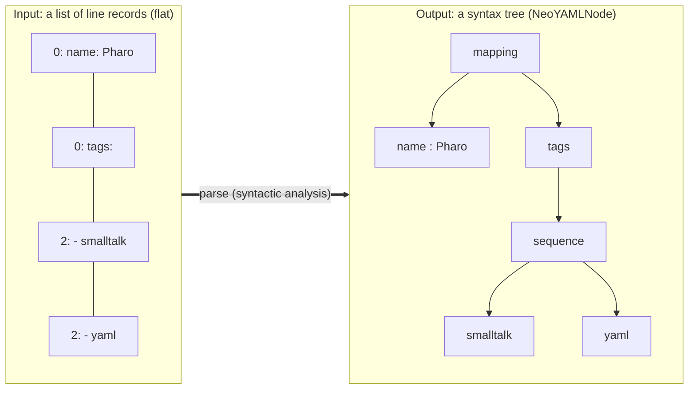

# Parser internals

> 日本語版: [parser.ja.md](parser.ja.md)

`NeoYAMLParser` (package `NeoYAML-Core-Parse`) is the **parse** stage of the
read pipeline — the **syntactic analysis**. It takes the flat list of lines the
scanner produced and builds a tree (a syntax tree) that describes the YAML
structure. For the package layout and the overall read/write picture, see
[architecture.md](architecture.md); this document focuses on how the parser
works inside.

## YAML terms used here

These are the terms defined by the YAML 1.2.2 specification, used throughout
this document.

| Term | Meaning |
|---|---|
| scalar | a single value (string, number, boolean, null) |
| mapping | key/value pairs (`key: value`); becomes a Pharo `Dictionary` |
| sequence | an ordered list (`- item`); becomes an `Array` |
| block style | the multi-line form that uses indentation for structure |
| flow style | the one-line, JSON-like form (`{a: 1, b: 2}`, `[1, 2, 3]`) |
| block scalar | a multi-line string (detailed below) |
| tag | an explicit type marker such as `!!str` |

## The parser in the read pipeline

Reading happens in three stages. The parser is the middle one: it consumes the
scanner's output and hands a syntax tree to the constructor.



## Syntactic analysis

What the parser does is the same as a compiler's syntactic analysis: read a
flat input (here, one line record per line), recognize the grammatical
structure, and build a tree. Take this input:

```yaml
name: Pharo
tags:
  - smalltalk
  - yaml
```

These four lines become one syntax tree:



The important point is that this stage **decides structure only, not a value's
final type**. It does not decide whether `123` becomes an integer or the
string `'123'`. The parser only records whether a scalar was quoted (plain,
single-, or double-quoted) and whether it carried an explicit tag. The type is
decided by the next stage, `NeoYAMLConstructor`. Because the two stages are
separate, a quoted `'123'` stays a string while a bare `123` becomes a number.

## Input (line records)

The scanner hands the parser a list of `indent -> content` pairs, one per line,
in order. Blank lines are kept as the sentinel `-1 -> ''`. The parser holds
this list in `entries` and reads it from the front with a 1-based `position`
cursor.

The YAML above becomes these line records:

| position | indent | content        |
|----------|--------|----------------|
| 1        | `0`    | `name: Pharo`  |
| 2        | `0`    | `tags:`        |
| 3        | `2`    | `- smalltalk`  |
| 4        | `2`    | `- yaml`       |

The parser never re-reads the raw text. Indentation is already computed, and
blank/comment handling is decided line by line as it reads. Two helpers manage
the cursor: `skipBlankEntries` skips blank and comment-only lines, and
`advance` moves forward one line after consuming it.

## Node-type selection (`parseNodeAtIndent:`)

Processing starts at `parseNode`, which (unless at the end) calls
`parseNodeAtIndent:` with the current line's indentation. This is the
predictive decision of a recursive-descent parser: it looks at the start of
the line and picks which production (node type) to apply.

In EBNF, the grammar the parser recognizes is as follows (this is the subset
the parser handles, not all of YAML; see [ROADMAP.md](../ROADMAP.md) for exact
coverage). `parseNodeAtIndent:` tries the alternatives of `node` top to bottom
and uses the first one whose leading token matches:

```ebnf
node        = flow-collection    (* line starts with { or [   *)
            | tagged-node        (* line starts with !!        *)
            | block-scalar       (* line is a | or > header    *)
            | sequence           (* "-" alone, or "- " ...     *)
            | mapping            (* line contains "key:"       *)
            | scalar ;           (* none of the above          *)

sequence    = seq-item { seq-item } ;   (* all at the same indentation *)
seq-item    = "-" [ " " node ] ;        (* empty item = empty scalar *)

mapping     = map-entry { map-entry } ; (* all at the same indentation *)
map-entry   = scalar ":" node ;         (* node is inline or a deeper-indented block *)

flow-collection = flow-mapping | flow-sequence ;
flow-mapping    = "{" [ flow-pair { "," flow-pair } ] "}" ;
flow-sequence   = "[" [ flow-value { "," flow-value } ] "]" ;
flow-pair       = flow-value ":" flow-value ;
flow-value      = flow-mapping | flow-sequence | scalar ;

tagged-node = "!!" tag-name [ scalar | flow-collection ] ;

block-scalar = ( "|" | ">" ) [ "-" | "+" ] newline indented-lines ;

scalar      = plain | single-quoted | double-quoted ;
```

In the grammar, `tag-name`, `plain`, `single-quoted`, `double-quoted`,
`indented-lines`, and `newline` are **terminals**: the smallest, indivisible
tokens. They are not expanded into further rules; they are used as-is. Each one
means:

| Terminal | Meaning |
|---|---|
| `plain` | an unquoted scalar (e.g. `hello`, `123`) |
| `single-quoted` | a single-quoted string (`'...'`) |
| `double-quoted` | a double-quoted string (`"..."`) |
| `tag-name` | the name after `!!` (`str` in `!!str`) |
| `indented-lines` | the body lines of a block scalar (indented) |
| `newline` | a line break |

The comment beside each `node` alternative is the leading token (the lookahead)
that selects it. Because the alternatives are tried top to bottom, input that
could look like more than one production — such as `-5`, which resembles both a
scalar and a sequence — still resolves to the right rule. The two recognizer
methods behind this lookahead keep their conditions deliberately narrow, so
scalar content is not mistaken for a sequence or mapping:

- `looksLikeSequenceItem:` treats a line as a sequence item only when it is
  exactly `-` or starts with `- ` (dash and space). `-5` is a scalar, not a
  sequence item.
- `looksLikeMappingEntry:` treats a line as a mapping entry only when a colon
  outside quotes is followed by a space or the end of line. Whether a colon is
  inside quotes is tracked by `topLevelColonIndexIn:`. So `url: http://x` is
  split only at the first `: `, and `"a: b": value` is not split at the colon
  inside the quoted key.

## Parsing block style and flow style

Of the grammar in the EBNF above, collections (mappings and sequences) have two
surface forms. **Block style** spans multiple lines; **flow style** is written
on one line, like `[a, b]` or `{k: v}`. The parser reads a value as flow style
when it starts with `{` or `[`, and as block style otherwise. The same grammar
is read by two different techniques:

| Aspect | Block style | Flow style |
|---|---|---|
| Written as | multiple indented lines | one line (`[a, b]`, `{k: v}`) |
| Read by | one line at a time, using indentation | scanning one line character by character |
| Methods | `parseMappingNodeAtIndent:`, `parseSequenceNodeAtIndent:` | `parseFlowMappingNode:`, `parseFlowSequenceNode:` |

Either form repeats the same steps recursively when a value is nested. The
subsections below look at how each one reads.

### Block style (indentation-based)

`parseMappingNodeAtIndent:` and `parseSequenceNodeAtIndent:` each loop,
collecting lines at the **same indentation** as siblings, for as long as the
line keeps looking like the same kind of construct:

```smalltalk
[ self atEnd not
    and: [ self currentIndent = indent
        and: [ self looksLikeMappingEntry: self currentText ] ] ]
    whileTrue: [ entries add: (self parseMappingEntryNodeAt: indent) ].
```

For each entry, `parseMappingEntryNodeAt:` splits the key and value at the
colon and passes the value to `resolveValueNodeText:atParentIndent:`. Nesting
happens here. That method checks three cases in order:

1. An **explicit tag or block scalar** on the same line — build that node.
2. An **empty value** (for example `tags:` with the items on later lines) —
   recurse into the child block one indentation level deeper.
3. A **value on the same line** — build a scalar (or a flow collection if it
   starts with `{` or `[`).

This is how `tags:` followed by indented `- smalltalk` / `- yaml` gives `tags`
a sequence node as its value: the value is empty, so case 2 applies, and the
recursion picks up the deeper indentation.

### Flow style (character-stream)

When a value starts with `{` or `[`, the parser switches from lines to a
`ReadStream` over that text and reads the opening bracket, comma-separated
elements, and closing bracket in order. Each element goes through
`parseFlowValueNode:`, which can descend into a nested `{` or `[`. Whitespace
is skipped by `skipFlowWhitespace:`, and quoted scalars are taken verbatim by
`extractFlowQuotedText:`, so a comma or bracket inside quotes does not end an
element.

## Block scalars

A block scalar header (`|`, `>`, optionally with a `-`/`+` chomping indicator)
is recognized by `isBlockScalarHeader:`. `parseBlockScalarNodeWithHeader:` then
collects the following lines that are **indented deeper than the parent**,
including blank lines:

```smalltalk
blockScalarShouldContinueAt: parentIndent
    | entry |
    entry := entries at: position.
    entry key = -1 ifTrue: [ ^ true ].          "blank line: keep it"
    ^ entry key > parentIndent                  "deeper than parent: part of body"
```

Keeping blank lines here is why the scanner keeps them as `-1 -> ''` instead of
dropping them: inside a block scalar, a blank line is real content and a `#` is
a literal character, not a comment. The collected lines are re-joined by
`joinBlockScalarLines:`, which restores each line's indentation relative to the
auto-detected base indent (the indentation of the first non-blank line). The
node records only `style` (`#literal` / `#folded`) and the raw `chomping`
character, and leaves the actual folding/chomping to the constructor.

## Quote-aware comment stripping

Comments are not stripped up front; the parser strips them line by line as it
reads (`stripCommentFrom:`). The point is that a `#` is a comment only when it
is at the start of a line or right after whitespace, **and** outside a quoted
string. `commentStartIndexIn:` reads the line one character at a time, tracking
whether it is inside quotes, so that:

- `key: value # note` drops ` # note`.
- `key: "a # b"` keeps the `#` — it is inside a double-quoted string.
- `url: http://x#y` keeps the `#` — there is no whitespace before it, so it is
  not a comment.

The same quote tracking is used by `topLevelColonIndexIn:` to find the colon
between a key and value. Both are small character scans, needed because YAML's
plain scalars can legitimately contain `#` and `:`.

## What the parser does not do

- **Deciding types** — the constructor decides the final type. The same `123`,
  for example, becomes an integer when unquoted but a string when written
  `'123'`. The parser only records the quoting (`style`) and any tag (`tag`);
  it does not decide the type itself.
- **Folding and chomping of block scalars** — the parser records the raw body
  and header; the constructor does the folding/chomping.
- **Splitting documents** — a `---`/`...` multi-document stream is split by
  `NeoYAMLReader` as raw-text preprocessing, before the parser runs. The parser
  only ever sees one document's worth of lines.

For the exact set of YAML features covered and the known limitations, see
`NeoYAMLReader`'s class comment and [ROADMAP.md](../ROADMAP.md).
